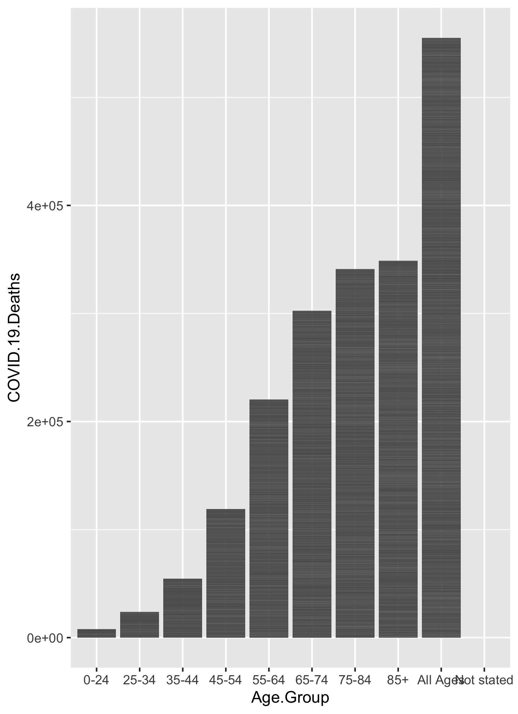
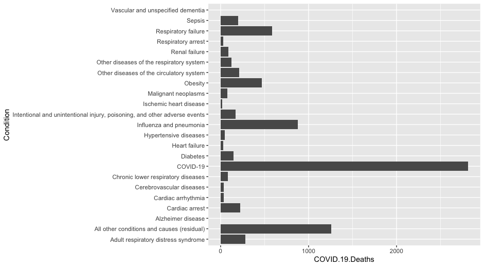

## Initial Analysis Goals:

- What is the predominant condition contributing with COVID-19 deaths according with the age,
- Comparisons between year 2020 ans 2021 and see if the conditions are the same for both years

Since age data was categorical, analysis was kept to barcharts.

## Data Cleaning & Import

The data using in this assignment is from the CDC [https://data.cdc.gov/NCHS/Conditions-Contributing-to-COVID-19-Deaths-by-Stat/hk9y-quqm](https://data.cdc.gov/NCHS/Conditions-Contributing-to-COVID-19-Deaths-by-Stat/hk9y-quqm)

- This dataset shows health conditions and contributing causes mentioned in conjunction with deaths involving coronavirus disease 2019 (COVID-19)

All cleaning and processing code is in the "code/processing" folder

## Workflow

Table \@ref(tab:summarytable) shows a table summarizing the data.

```{r summarytable1,  echo=FALSE}
resulttable=readRDS("../../results/summarytable.rds")
knitr::kable(resulttable, caption = 'Data summary table.')
```


Data was tranformed to be categorized by age first. The author intended on having porportions in the table, but the user error prevented this from happening in R.

Table \@ref(tab:table1) shows a table summarizing the data.

```{r summarytable2,  echo=FALSE}
resulttable=readRDS("../../results/table1.rds")
knitr::kable(resulttable, caption = 'Age stratified summary table.')
```


# This figure looks at death rates by age

Figure \@ref(fig:plot1) shows a bar chart figure produced by one of the R scripts.

```{r resultfigure1,  fig.cap='Analysis figure 1. Age stratified Covid-19 deaths', echo=FALSE}

```


#This figure looks at conditions at time of death in those ages 0-24
Figure \@ref(fig:plot2) shows a bar chart figure produced by one of the R scripts.

```{r resultfigure2,  fig.cap='Analysis figure 1. Conditions at time of death in those ages 0-24', echo=FALSE}

```


